# qiudengs-svg-diagrams

[English](README.en.md)

为 AI 编程助手提供软件需求分析与系统设计的 SVG 绘图规范、模板和正反例。重点是让关系容易读懂：直接连线、清楚分组、稳定间距，以及克制的配色。

生成的 SVG 可直接在浏览器中查看，也可继续编辑，无需安装额外依赖。

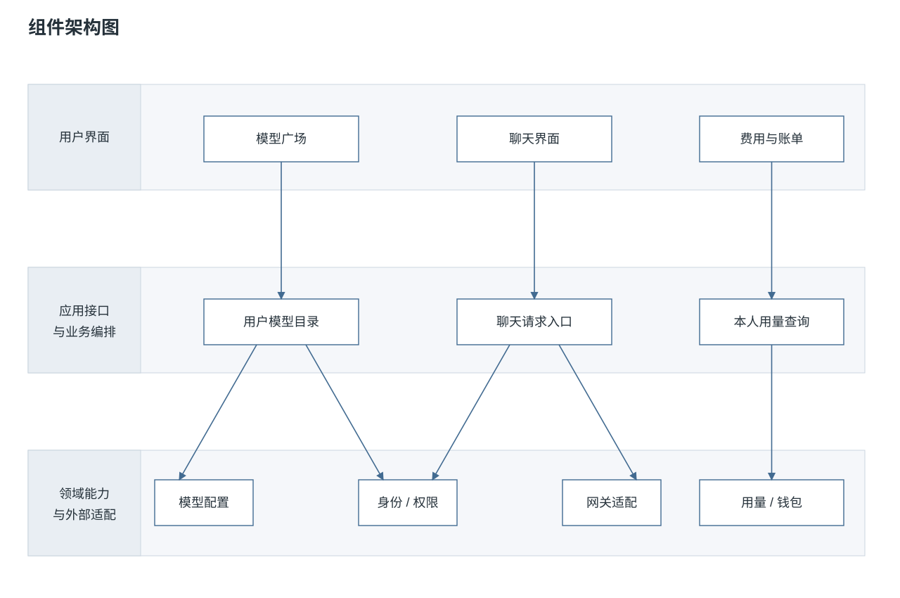

## 使用

将仓库克隆到本地 skills 目录。以本项目使用的目录为例：

```bash
git clone https://github.com/qiudeng7/qiudengs-svg-diagrams.git \
  ~/.codex/skills/qiudengs-svg-diagrams
```

写提示词:

```text
使用 $qiudengs-svg-diagrams，随意画一个中等复杂度的架构图。
```

然后你会得到一个 svg 格式的图，例如[](assets/components.svg)

## 预览

上方展示[组件架构图](assets/components.svg)。其余七种模板如下，展开即可预览；点击图片可查看原文件。

<details>
<summary>系统上下文图 · 系统与哪些参与方交互？</summary>

[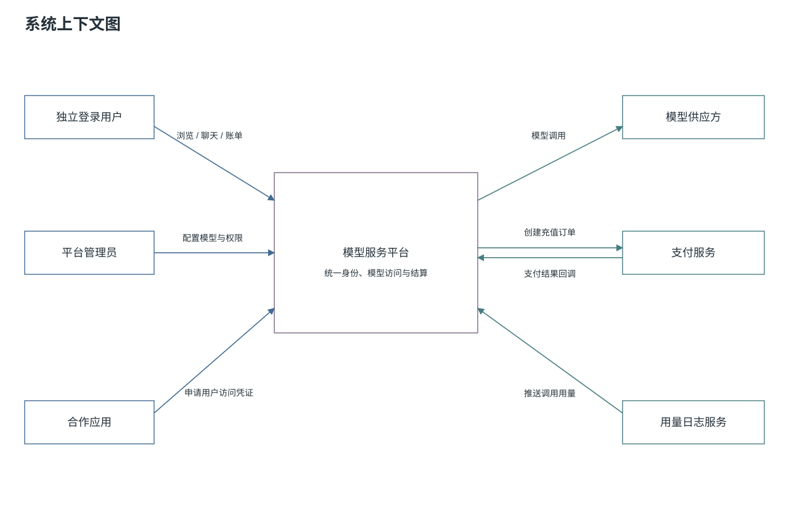](assets/context.svg)

</details>

<details>
<summary>用例图 · 不同用户能够完成什么？</summary>

[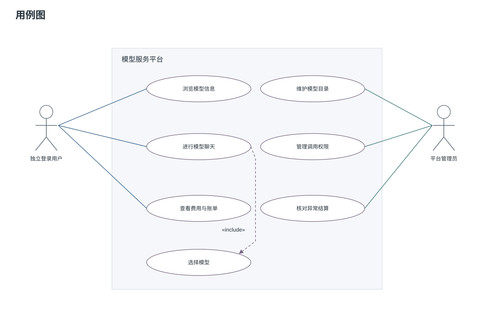](assets/use-case.svg)

</details>

<details>
<summary>业务流程图 · 业务怎样推进，异常如何处理？</summary>

[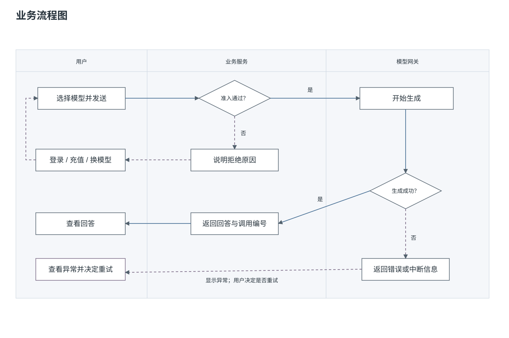](assets/flow.svg)

</details>

<details>
<summary>状态图 · 状态如何随事件变化？</summary>

[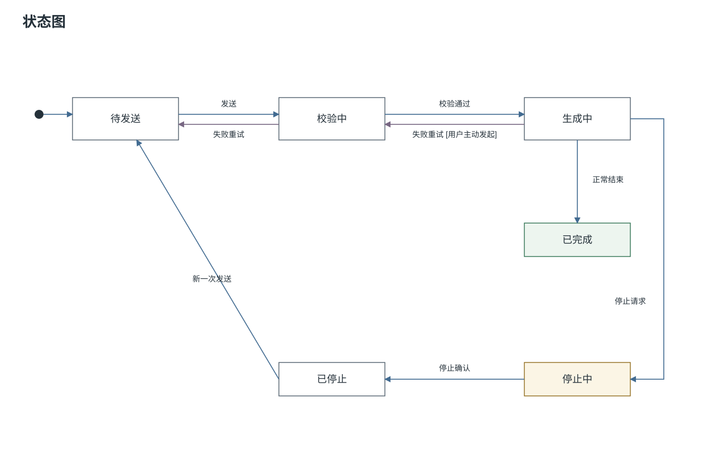](assets/state.svg)

</details>

<details>
<summary>关键时序图 · 组件按什么顺序协作？</summary>

[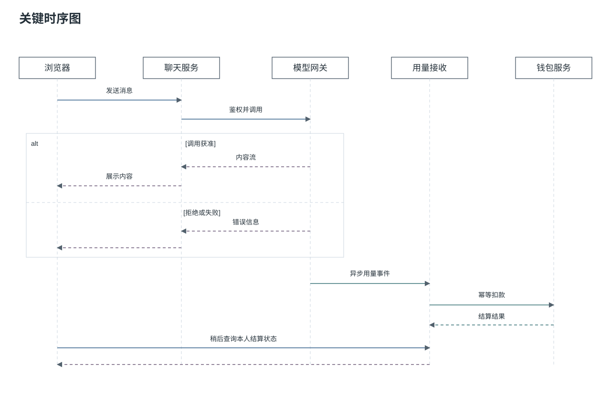](assets/sequence.svg)

</details>

<details>
<summary>数据关系图 · 对象如何关联，数量约束是什么？</summary>

[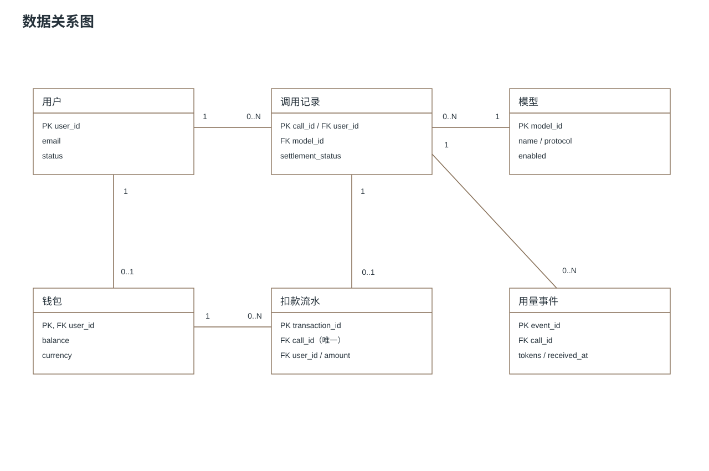](assets/er.svg)

</details>

<details>
<summary>页面线框图 · 用户在哪里查看信息和操作？</summary>

[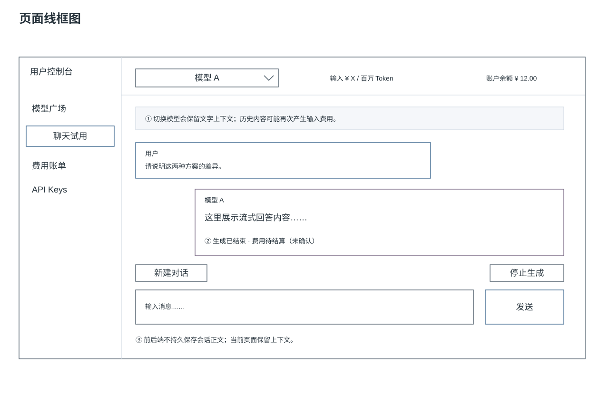](assets/wireframe.svg)

</details>

## 正反例

这些例子展示布局如何影响阅读，不要求为了视觉整齐改变业务语义。详细说明见[绘图规则](references/drawing-rules.md#分组标识与关系布局)。

### 分组标题

为标题预留独立空间，避开内容与连线。侧边标题适用于此例，不是所有图的固定要求。

| 反例 | 正例 |
|---|---|
| [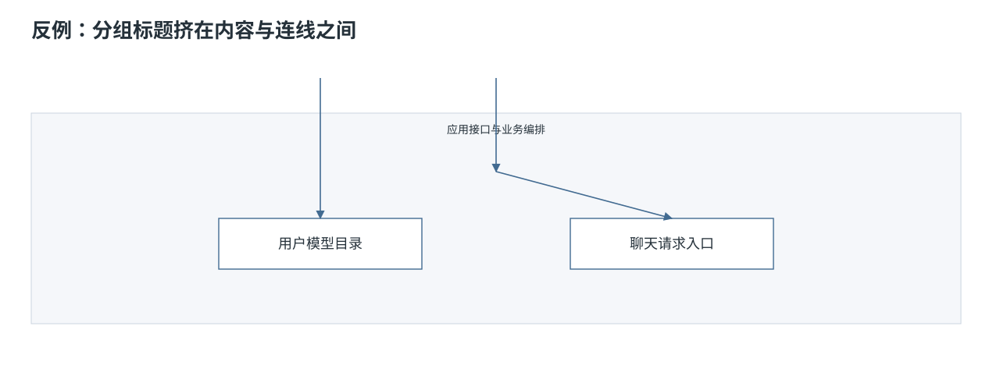](references/examples/group-label-bad.svg) | [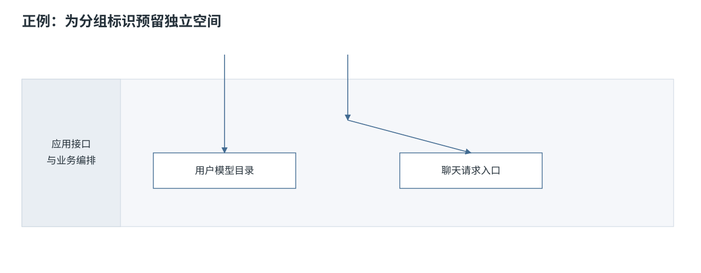](references/examples/group-label-good.svg) |

### 依赖布局

共享依赖靠近关联节点的中心，专属依赖靠近各自对象。只有关系本身对称时，才采用对称布局。

| 反例 | 正例 |
|---|---|
| [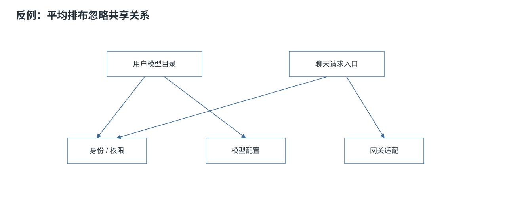](references/examples/dependency-affinity-bad.svg) | [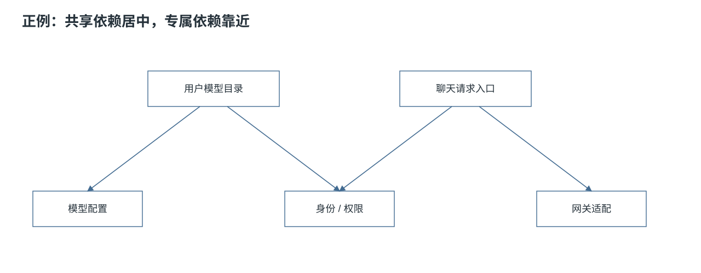](references/examples/dependency-affinity-good.svg) |

### 短重试回环

简单的失败重试直接标在返回线上。若失败需要独立保存或有后续分支，仍应保留失败状态。

| 反例 | 正例 |
|---|---|
| [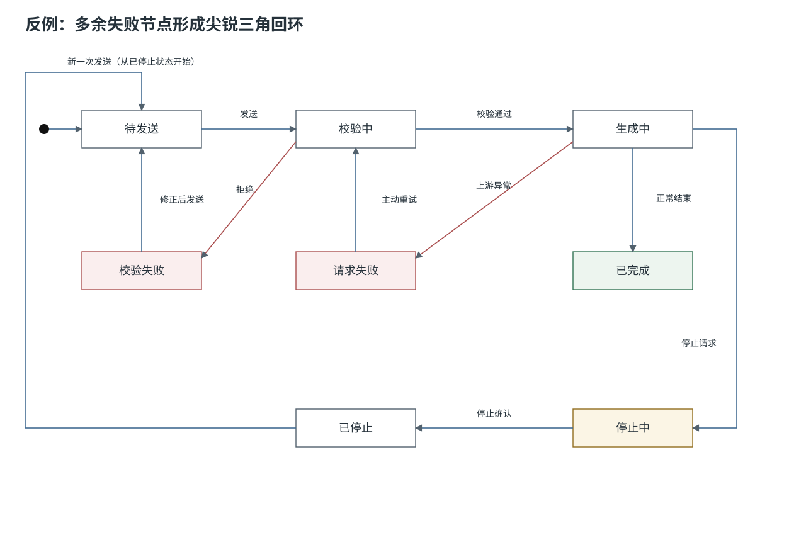](references/examples/state-retry-bad.svg) | [](assets/state.svg) |

## 使用边界

- 模板提供表达方式，实际绘图应根据需求重新安排节点、标签和连线。
- SVG 使用系统字体回退，不依赖外部资源。不同环境的字体可能不同，仍需留出文字空间并检查呈现。
- 标题和业务标记保留在图中；配色、线型及布局方法的解释放在文档中。
- 在 Issue、PR 或其他平台发布图时，需确认目标位置是否支持 SVG。

## 仓库结构

```text
SKILL.md
README.md
README.en.md
assets/                    八种 SVG 模板
references/
  drawing-rules.md         绘图规则
  examples/                SVG 正反例
```

修改规则或模板后，检查相对链接、SVG 结构和实际布局。所有预览直接引用源文件，无需运行演示网站。
